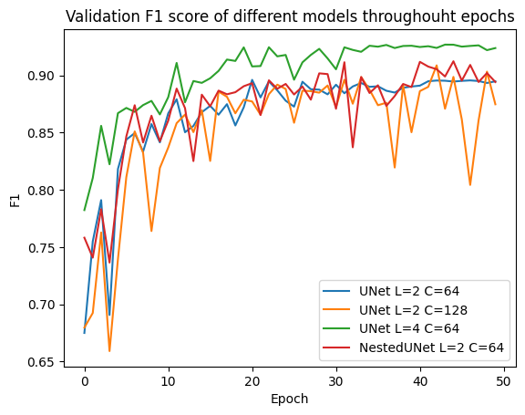

# CS-433 : Road Segmentation

## Group Members - CQTV:

- Adrien Omar Aït Lalim (adrien.aitlalim@epfl.ch), SCIPER : **326588**
- Youssef Amine (youssef.amine@epfl.ch), SCIPER: **324253**
- Liess Gröli (liess.groeli@epfl.ch), SCIPER: **327521**

---

## Overview:

In this project, we address the challenge of image segmentation by focusing on pixel-wise road segmentation from satellite images. Our goal is to accurately classify image patches into road and background classes, a task complicated by obstructions such as trees, buildings, and vehicles, as well as ambiguous structures like walkways and railroads.
To tackle this, we employ state-of-the-art deep learning techniques using U-Net and U-Net++ architectures. These networks, known for their efficacy in biomedical image segmentation, are adapted for our satellite imagery dataset. By leveraging these architectures, we aim to optimize segmentation performance even with a relatively small training dataset.
Our best model achieves an F1 score of 0.908 and a categorical accuracy of 0.949, demonstrating the effectiveness of U-Net and U-Net++ in this domain.

---

## Folder structure:
Now let's have a look at our project is sturctured:

```bash
    ml-project-2-cqtv2-0/
    ├── README.md #README file
    ├── requirements.txt #The requirements of the interpretor
    ├── run.py  #File used to train a new model
    ├── predict.py 
    ├── data/
    |   ├── test_set_images/
    |   └── training/
    ├── dataprocessing/
    |   └── pre_process.py
    ├── losses/
    |   ├── AbstractLoss.py #File that create an abstract loss class.
    |   ├── DiceLoss.py #File designing the Dice loss.
    |   └── IoULoss.py #File designing the IoU loss.
    ├── models/
    |   ├── CustomDataset.py # File that create a custom dataset.
    |   ├── NestedUNet.py # File that creates the nestedUNet model.
    |   └── UNet.py # File that creates UNet model.
    ├── results/
    |   ├── NestedUnet/
    |   |   ├── models/ # Pre trained models of NestedUnets
    |   |   └── results/ # Results generated during the training(Validation F1 score, mean losses, loss history)
    |   └── UNet/
    |   |   ├── models/ # Pre trained models of UNet
    |   |   └── results/ # Results generated during the training(Validation F1 score, mean losses, loss history)
    ├── scripts/
    |   └── train.py #File that contains the training file
    ├── submissions/ #Directory that contains the submission files to AIcrowd
    └── utils/
        ├── load_save.py
        ├── mask_to_submission.py
        ├── submission_to_mask.py
        ├── tf_aerial_images.py
        └── utils
```

---
## Data:

### Training and Test Data:

Training and test data is in the `data/` folder, where training data is in the `training/` folder, where as testing data in the  `test_set_images/` folder.
### Pre-trained Models:

We already trained some models and provided those who performs the best and can downloaded using this link [Here](https://drive.google.com/drive/folders/14NhAve6aNABjOpMuy992qnWQo69sOPww?usp=sharing).

Each of these models when loaded contains information about which model is it and their parameters:
- `models_2_64.pth`: `U-Net` model with `L=2` and `C=64` trained during `50 epochs`
- `models_2_128.pth`: `U-Net` model with `L=2` and `C=128` trained during `50 epochs`
- `models_4_64.pth`: `U-Net` model with `L=4` and `C=64` trained during `50 epochs`
- `nested_models_2_64.pth`: `Nested U-Net` model with `L=2` and `C=64` trained during `50 epochs`
---

## Training pipeline:

To train our model we should follow the pipeline in `run.py`, where we start by separating training and validation and then augmenting our training set using the `data_augmentation` method in `dataprocessing/pre_process.py` then launch the chosen models with the `train` function in `scripts/train.py`.

---

## User manual:

### Setting up python environment:
Before delving into our model training strategy, it’s crucial to define a standardized Python environment and list the exact package dependencies.

**Python Version**: `3.10.11`

**Required Packages**:
- `tensorflow`
- `torch`
- `numpy`
- `pandas`
- `scikit-learn`
- `matplotlib`
- `opencv-python`
- `torchvision`
- `torchsummary`
- `tqdm`
- `Pillow`
- `seaborn`
- `jupyter`
- `scikit-image`

To ensure your setup is consistent and the program runs smoothly, you can either install each package manually or use the following command to install them all at once:

```sh
pip install -r requirements.txt
```
    
### Training a new model:

To train a new model from scratch, you should first make sure that that the data is unzipped and placed into the `data/` folder. We can then train our model by running the file `run.py` with the following parameters:

- `--name` : The name of the model.
    - **Type**: `str`
    - **Default**: `unet`
    - **Choices**: `['unet', 'nestedunet']`
- `--C`: The number of base channels.
    - **Type**: `int`
    - **Default**: `64`
- `--L`: The number of sequential block in a convulotion block.
    - **Type**: `int`
    - **Default**: `2`
- `--device`: The device name. Default value 'cpu'.
    - **Type**: `str`
    - **Default**: `cpu`
    - **Choices**: `['cpu', 'cuda', 'mps']`
- `--batch_size`: The batch size of the batches we use for training.
    - **Type**: `int`
    - **Default**: `8`
- `--epochs`: The number of epochs we want to train our model.
    - **Type**: `int`
    - **Default**: `50`
- `--batch_number`: The number of batches trained per epochs.
    - **Type**: `int`
    - **Default**: `150`
- `--deep_supervision`: If deep_supervision is enabled.
    - **Type**: `bool`
    - **Default**: `False`
    - **Constraint** : deep_supervision is only available for `nestedunet`
- `--seed`: The seed of the random generator, if we want to reproduce our code.
    - **Type**: `int`
    - **Default**: `42` 
- `--light`: This parameter is used to enable or not a light training.
    - **Type**: `bool`
    - **Default**: `False` 

An example of launching a training would look like:
```sh
python -m run --name unet --C 64 --L 2 --device cuda --batch_size 8 --epochs 50 --batch_number 150 --deep_supervision False --seed 42
```

Note : Training takes a lot of memory we recommand to use light training and `BATCH_SIZE=4`, but the drawback is that tne training wouldn't be as effective.
### Using a pre-trained Model:

We have already trained  different models already that we can use, to create our predictions. Each of the files will contain both the state of the model and different that would enable us to repeat the experience, by calling the function `load_checkpoint` from the file `utils/load_save.py`. Each file that containing the pre trained models has the following form:

- `model_state_dict` : The state of the saved model we have saved.
- `info`: This dict contains all the information related to the training of the saved model
    - `epoch`: The epoch with the best result.
    - `model_name`: The name of the model.
    - `L`: The number of sequential block per convolution block.
    - `C`: The number of base channels.
    - `in_channels`: The number of input channels.
    - `out_channels`: The number of output channels.
    - `deep_supervision`: This argument if deep_supervision is enabled.
    - `validation_f1` : The f1 score on the validation set.
    - `validation_loss`: The loss on the validation set 
    - `loss` : The mean training loss of the best epoch.
    - `loss_function` : The loss function we have been using.
    - `epochs` : The total number of epochs that we trained our model with.
    - `batch_size` : The batch size of the batches we train.
    - `batch_number` : The number of batches trained per epochs
    - `seed` : The seed used to setup the random generator if we want to generate the exact result
    - `optimzer`: All the information refering to the optimizer,
        - `name`: The name of the optimizer.
        - `lr`: The learning rate.
        - `weight_decay`: The weight decay of the optimizer to have a regularization.
    - `scheduler`:  All the information refering to the optimizer,
        - `name` : The name of the scheduler we will be using.
        - `params`: The parameters of the scheduler we are using

### Predict results:

To predict the test and get an ai crowd submission we should run the following commands:

```sh
python -m submit --path <path to the model we want to use to predict> --out <submission file path>
```

---

## Results:

We tried different models and recorded at each epoch the validation f1 score to determine the best one. Here are our best results:



| Model Name |  C  |  L  |  epochs  | Best epoch |  Loss func  |  Validation Loss  |  Validation F1 score  |  Aicrowd F1  |  submission ID  |
|:----------:|:---:|:---:|:--------:|:----------:|:-----------:|:-----------------:|:---------------------:|:------------:|:---------------:|
| U-Net      | 64  |  2  |    50    |     20     | Dice loss   |      0.082        |         0.896         |     0.897    |     #278026     |
| U-Net      | 128 |  2  |    50    |     42     | Dice loss   |      0.075        |         0.909         |     0.876    |     #278025     |
| U-Net      | 64  |  4  |    50    |     43     | Dice loss   |      0.057        |         0.911         |     0.908    |     #278023     |
| U-Net++    | 64  |  2  |    50    |     44     | Dice loss   |      0.074        |         0.927         |     0.902    |     #277592     |

---------------------

Our best result is achieved with `U-Net`, `L=4` and `C=64` with a score of 0.908 F1 score on AIcrowd (The submission ID is `#278023`), if we want to achieve the same result again we gain train a new model form scratch using the following command:
```sh
python -m run --L 4 --path <path of the file where we want to save the model>
```

then run

```sh
python -m predict --path <path of the model> --out <submission file>
```


---